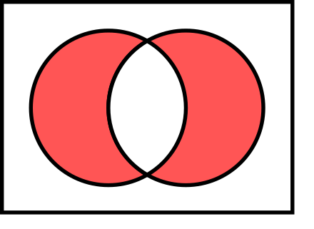

异或（Exclusive or）是对两个运算元的一种逻辑分析类型。与一般的逻辑或不同，当两两数值相同时为否，而数值不同时为真。不常使用异或操作符可能容易记错，这里有个小技巧：异或就是求异，找不同。

<!--more-->

<center></center>


# 异或操作

异或满足一下性质：

- 结合律：A^(B^C)=(A^B)^C
- 交换律：A^B=B^A
- 恒等律：A^0=A
- 归零律：A^A=0
- 对合运算：A^B^B=A^0=A

备注：^在编程语言中表示异或，和布尔代数中的运算符“逻辑与”不要弄混。

有一种密码称之为**互逆密码**，将明文输入密码学系统以获得密文一样，可以将密文输入到系统中的相同位置以获得明文。互易密码有时也称为**自反密码**。对合运算性质的操作常用于互逆密码。

因此异或操作有一个经典的加密算法即异或密码。


# 异或密码

比如文本串加密，文本串行的每个字符可以通过与给定的密钥进行按位异或运算来加密。如果要解密，只需要将加密后的结果与密钥再次进行按位异或运算即可。

如果使用不断重复的密钥，利用频率分析就可以破解这种简单的异或密码。如果消息的内容被猜出或知道，密钥就会泄露。异或密码值得使用的原因主要是其易于实现，而且**计算成本小**。简单重复异或加密有时用于不需要特别安全的情况下来隐藏信息。

如果密钥是随机的（不重复），而且与消息长度相同，异或密码就会更为安全。当然异或密码运算符在[已知明文攻击](https://zh.wikipedia.org/wiki/已知明文攻击)下是脆弱的。因为明文^密文=密钥。

设A为明文，B为密钥，C为密文，则A^B=C，则A^C=A^A^B=B，很容易根据A和C求B


# 字符串异或加密

字符串异或加密代码如下：

```python
def test_string_xor():
    """测试异或加密解密"""
    message = 'This is a secret message'
    key = 'whoami'
    encrypted = string_xor(message, key)
    decrypted = string_xor(encrypted, key)
    assert message == decrypted

    # 输出加密后的字符串,可能是乱码，一般会再base64下
    print('xor-encrypted:', encrypted)

    # 输出解密后的字符串 'This is a secret message'
    print('xor-decrypted:', decrypted)

    decrypted_key = string_xor(message, encrypted)
    # 输出解密后的key 'whoami'
    print("xor-key:", decrypted_key)


def string_xor(message: str, key: str) -> str:
    """字符串异或"""
    key_patch = []
    len_key = len(key)
    len_msg = len(message)
    for i in range(len_msg):
        if i >= len_key:
            key_patch.append(key[i % len_key])
        else:
            key_patch.append(key[i])
    return "".join([chr(ord(c) ^ ord(k)) for (c, k) in zip(message, key_patch)])

```


# 图片异或加密

使用opencv进行图片加密很贱，图片异或加密的代码如下：

```python
def image_xor(image, image_key):
    """图片异或"""
    return cv2.bitwise_xor(image, image_key)


def test_image_xor():
    """测试图片异或"""
    img = cv2.imread(data_file_path('data/image/dog_bike_car.jpg'))
    # 创建一个和原图像大小相同的随机图像
    rows, cols, channels = img.shape
    img_key = np.random.randint(0, 256, (rows, cols, 3), dtype=np.uint8)
    cv2.imshow('img', img)
    cv2.imshow('img_key', img_key)

    img_encrypted = image_xor(img, img_key)
    cv2.imshow('img_encrypted', img_encrypted)
    img_decrypted = image_xor(img_encrypted, img_key)
    cv2.imshow('img_decrypted', img_decrypted)

    xor_key = image_xor(img, img_encrypted)
    cv2.imshow('xor_key', xor_key)

    cv2.waitKey(0)
    cv2.destroyAllWindows()
```


直接使用异或加密很简单，但是很不安全，所以异或一般作为更为复杂的加密算法的组成部分。

关于图片强加密有一篇综述写的不错：An overview of encryption algorithms in color images。


