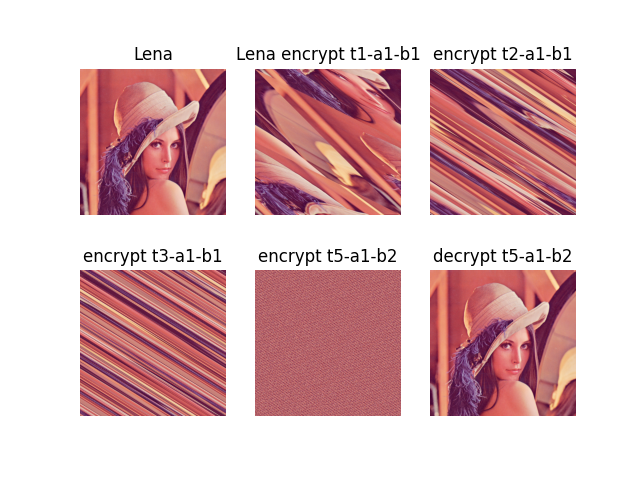
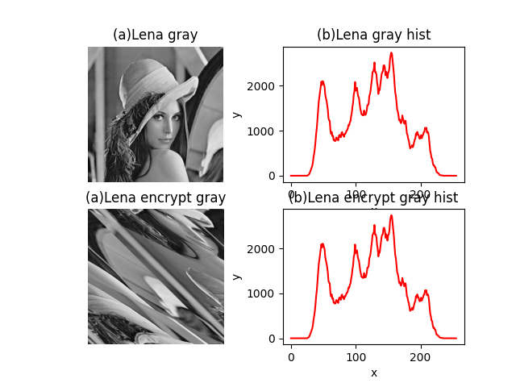
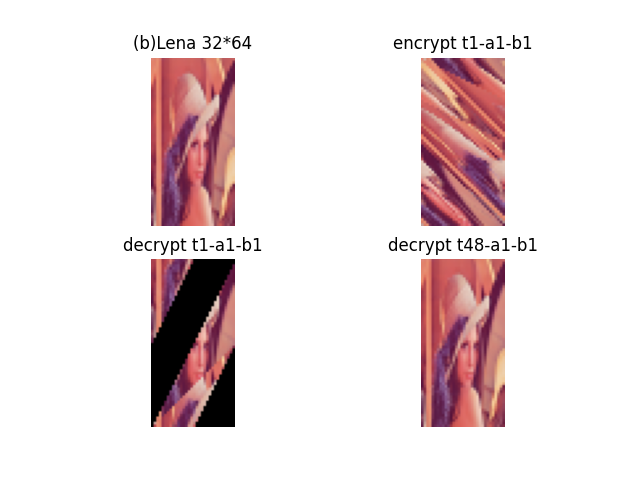

上文提到异或加密比较简单，会被已知明文攻击。所以本次引入一个猫脸转换(Arnold变换)加密，参考An overview of encryption algorithms in color images。

<!--more-->

# Arnold变换

猫脸变换即Arnold变换，据说是因第一张验证图片是猫脸而得名。可以对图像进行置乱，使得原本有意义的图像变成一张无意义的图像。可以看作是拉伸，压缩，折叠及拼接的过程（仿射变换），使得原本有意义的图像变成一张无意义的图像。通过这一过程，可以将离散化的数字图像矩阵中的点重新排列，使其他人无法获取图像真实内容。该变换可以用于图片加密，也可以用于水印部分的置乱。

当图像的长宽相等是，Arnold可以进行逆变换。相应的变换公式和逆变换公式可以用于快速的加密和解密。

​	正变换公式如下：

$$\left(\begin{array}{cc}x' \\ y' \end{array}\right)=\left[\begin{array}{a}1 & a \\ b & ab+1 \end{array} \right]\left(\begin{array}{b} x \\y \end{array} \right)mod(N)$$


逆变换公式如下：

$$\left(\begin{array}{cc}x \\ y \end{array}\right)=\left[\begin{array}{a}ab+1 & -a \\ -b & 1 \end{array} \right]\left(\begin{array}{b} x' \\y' \end{array} \right)mod(N)$$


通常一次Arnold变换达不到理想效果，需要对图像进行连续多次的变换。Arnold变换具有周期性，即对图像连续进行Arnold变换，最终又能得到原图像。变换的周期和图像的尺寸有关，统计如下表：

表1-1 Arnold变换周期

| 边长N     | 2    | 4    | 8    | 16   | 32   | 64   | 128  | 246  | 512  | 1024 |
| --------- | ---- | ---- | ---- | ---- | ---- | ---- | ---- | ---- | ---- | ---- |
| **周期T** | 3    | 3    | 6    | 12   | 24   | 48   | 96   | 192  | 384  | 768  |


# 变换代码


```python
def arnold(img, shuffle_times, a, b):
    """Arnold's cat map"""
    r, c, d = img.shape
    p = np.zeros(img.shape, np.uint8)
    for s in range(shuffle_times):
        for i in range(r):
            for j in range(c):
                x = (i + b * j) % r
                y = (a * i + (a * b + 1) * j) % c
                p[x, y, :] = img[i, j, :]
        img = np.copy(p)
    return p
```


# 逆变换代码

```python
def de_arnold(img, shuffle_times, a, b):
    """Arnold's cat map"""
    r, c, d = img.shape
    p = np.zeros(img.shape, np.uint8)
    for s in range(shuffle_times):
        for i in range(r):
            for j in range(c):
                x = ((a * b + 1) * i - b * j) % r
                y = (- a * i + j) % c
                p[x, y, :] = img[i, j, :]
        img = np.copy(p)
    return p

```


# 验证不同参数


```python
def test_arnold():
    """测试Arnold's cat map"""
    img = cv2.imread(data_file_path('data/image/lena.png'))

    plt.subplot(231)
    plt.imshow(cv2.cvtColor(img, cv2.COLOR_BGR2RGB))
    plt.axis('off')
    plt.title("Lena")

    plt.subplot(232)
    plt.imshow(cv2.cvtColor(arnold(img, 1, 1, 1), cv2.COLOR_BGR2RGB))
    plt.axis('off')
    plt.title("Lena encrypt t1-a1-b1")

    plt.subplot(233)
    plt.imshow(cv2.cvtColor(arnold(img, 2, 1, 1), cv2.COLOR_BGR2RGB))
    plt.axis('off')
    plt.title("encrypt t2-a1-b1")

    plt.subplot(234)
    plt.imshow(cv2.cvtColor(arnold(img, 3, 1, 1), cv2.COLOR_BGR2RGB))
    plt.axis('off')
    plt.title("encrypt t3-a1-b1")

    encrypt_img = arnold(img, 5, 1, 2)
    plt.subplot(235)
    plt.imshow(cv2.cvtColor(arnold(img, 5, 1, 2), cv2.COLOR_BGR2RGB))
    plt.axis('off')
    plt.title("encrypt t5-a1-b2")

    decrypt_img = de_arnold(encrypt_img, 5, 1, 2)
    plt.subplot(236)
    plt.imshow(cv2.cvtColor(decrypt_img, cv2.COLOR_BGR2RGB))
    plt.axis('off')
    plt.title("decrypt t5-a1-b2")

    plt.show()
```


代码输出如下：

<center></center>

可以看到虽然5次a=1 b=2的变换后图片已经摇匀了，但是经过一次逆变换还是可以无损变回原图。


# 验证直方图不变

Arnold变换只是改变了像素值的位置，其像素值是没发生变化的，因此其像素直方图统计特性是没有改变的，非常有利于采用直方图平移嵌入额外信息。也正是因为像素值没发生变化，其图像的信息内容存在着泄漏可能。

```python
def test_histogram():
    """猫脸变化直方图"""
    img = cv2.imread(data_file_path('data/image/lena.png'))
    gray_img = cv2.cvtColor(img, cv2.COLOR_BGR2GRAY)
    hist = cv2.calcHist([gray_img], [0], None, [256], [0, 255])  # 计算图像第一个通道的直方图

    encrypt_img = arnold(img, 1, 1, 1)
    gray_encrypt_img = cv2.cvtColor(encrypt_img, cv2.COLOR_BGR2GRAY)
    encrypt_hist = cv2.calcHist([gray_encrypt_img], [0], None, [256], [0, 255])  # 计算图像第一个通道的直方图

    assert np.array_equal(hist, encrypt_hist)

    # 设置字体
    matplotlib.rcParams['font.sans-serif'] = ['SimHei']

    # 显示原始图像和绘制的直方图
    plt.subplot(221)
    plt.imshow(gray_img, 'gray')
    plt.axis('off')
    plt.title("(a)Lena灰度图像")

    plt.subplot(222)
    plt.plot(hist, color='r')
    plt.xlabel("x")
    plt.ylabel("y")
    plt.title("(b)直方图曲线")

    plt.subplot(223)
    plt.imshow(gray_encrypt_img, 'gray')
    plt.axis('off')
    plt.title("(a)Lena转换后灰度图像")

    plt.subplot(224)
    plt.plot(encrypt_hist, color='r')
    plt.xlabel("x")
    plt.ylabel("y")
    plt.title("(b)直方图曲线")

    plt.show()
```


输出结果参考


<center></center>


# 验证周期


如果图片的长不等于宽时，Arnold变换逆变换不成立，如何还原图像呢。这时候就可以结合周期表了，我们让图片变换周期次数就可以了。那么问题又来了，长宽不等，那么对应的周期也不等，我们选择长的周期还是宽的周期。一个保守的方案是选择长周期和宽周期的最小公倍数。

通过狭义的（a=1,b-1）Arnold变换周期表，我们大概可以看到周期约等于边长的0.75倍。为了方便演示，我们吧lena图片进行缩放为（32,64），结合周期表知道64的周期为48.进行验证如下：


```python
 
def test_arnold_period():
    """猫脸变化直方图"""
    img = cv2.imread(data_file_path('data/image/lena.png'))
    img_small = cv2.resize(img, (32, 64), interpolation=cv2.INTER_AREA)

    plt.subplot(221)
    plt.imshow(cv2.cvtColor(img_small, cv2.COLOR_BGR2RGB))
    plt.axis('off')
    plt.title("(b)Lena 32*64")

    encrypt = arnold(img_small, 1, 1, 1)
    plt.subplot(222)
    plt.imshow(cv2.cvtColor(encrypt, cv2.COLOR_BGR2RGB))
    plt.axis('off')
    plt.title("encrypt t1-a1-b1")

    plt.subplot(223)
    # 逆变换已经不管用了
    plt.imshow(cv2.cvtColor(de_arnold(encrypt, 1, 1, 1), cv2.COLOR_BGR2RGB))
    plt.axis('off')
    plt.title("decrypt t1-a1-b1")

    plt.subplot(224)
    # 47 对应边长64的周期48（应该是长宽两个周期的最小公倍数）然后减去1，即47
    plt.imshow(cv2.cvtColor(arnold(encrypt, 47, 1, 1), cv2.COLOR_BGR2RGB))
    plt.axis('off')
    plt.title("decrypt t48-a1-b1")

    plt.show()

```


<center></center>


