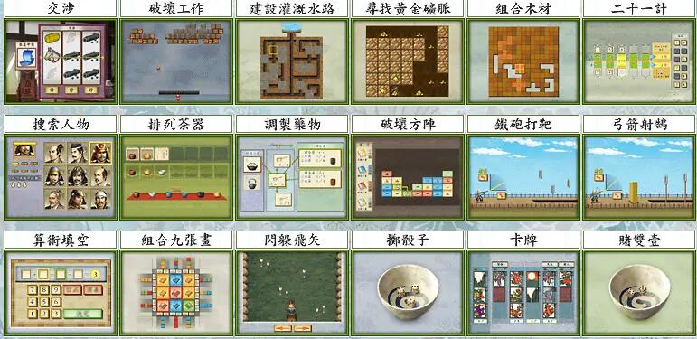

#### 最难忘的游戏
大学时代，买入一台组装机，预装了大富翁4，初完颇为兴奋，久完索然乏味。后来室友纷纷推荐，玩了少许新的游戏，最让人沉醉的还是太阁立志传5。那段缤纷绚丽的战国历史犹在眼前，猴子，第六天魔王，独眼龙，风林火山，车悬，无刀取，转，忍犬之术，雷暴之术，村雨，剑圣历历在目。

<!--more-->





#### 那些小游戏

当我孩子还未长大，我想我会让他熟悉这些小游戏，无论是算数填空，二十一记，还是调制药物，排列茶器，都是值得一试的智力小游戏。我想做一个电脑抑或手机的锁屏游戏，难度随着学历增长吧。啊哈，会成为他的童年乐趣（阴影）吧。


#### 24点

我的家人们最喜欢玩的纸牌游戏就是24点了，无论小学生还是研究生，寻找四张牌中的数学奥妙总让人乐此不疲。也许那时就慢慢培养了数学兴趣。

很久就想写下各个小游戏的实现，总是把时间分给了玩游戏，所以做游戏反而不得闲了。后来想也许我得在自己的网站上试试code style。那就小游戏写写吧（玩游戏菜鸟，写游戏亦然）。


##### 表达式穷举

```java
public class Point24 {

    public static void main(String[] args) {
        calculate(Lists.newArrayList(6, 6, 6, 6)).forEach(System.out::println);
        System.out.println();

        calculate(Lists.newArrayList(1, 2, 1, 7)).forEach(System.out::println);
        System.out.println();

        calculate(Lists.newArrayList(3, 3, 7, 7)).forEach(System.out::println);
        System.out.println();

        calculate(Lists.newArrayList(3, 3, 8, 8)).forEach(System.out::println);
        System.out.println();

        calculate(Lists.newArrayList(1, 5, 5, 5)).forEach(System.out::println);
        System.out.println();

        calculate(Lists.newArrayList(1, 9, 8, 7)).forEach(System.out::println);
        System.out.println();
    }

    public static Set<String> calculate(List<Integer> numbers) {
        List<String> opList = new ArrayList<>();
        opList.add("+");
        opList.add("-");
        opList.add("*");
        opList.add("/");

        List<List<Integer>> numberPerm = Permutation.permutation(numbers);
        List<List<String>> opSample = Sample.sample(opList, 3);
        return crossJoin(numberPerm, opSample);
    }

    public static Set<String> crossJoin(List<List<Integer>> a, List<List<String>> b) {
        Set<String> expression = new HashSet<>();
        a.forEach(ai -> {
            b.forEach(bi -> {
                List<String> result = cal(ai, bi);
                if (result != null) {
                    expression.addAll(result);
                }
            });
        });

        return expression;
    }

    private static List<String> cal(List<Integer> numbers, List<String> ops) {
        try {
            List<Exp> exps = numbers.stream().map(i -> new Exp(i.doubleValue())).collect(Collectors.toList());
            List<Integer> opIndex = Lists.newArrayList(0, 1, 2);
            List<List<Integer>> permutation = Permutation.permutation(opIndex);
            return permutation.stream().map(oi -> {
                Integer first = oi.get(0);
                Integer second = oi.get(1);
                Integer third = oi.get(2);

                Exp op1 = new Exp(ops.get(first), exps.get(first), exps.get(first + 1));
                Exp op2;
                Exp op3 = new Exp(0.0);
                if (second - first == 1) {
                    op2 = new Exp(ops.get(second), op1, exps.get(second + 1));

                    if (third > second) {
                        op3 = new Exp(ops.get(third), op2, exps.get(third + 1));
                    } else {
                        op3 = new Exp(ops.get(third), exps.get(third), op2);
                    }
                } else if (second - first == -1) {
                    op2 = new Exp(ops.get(second), exps.get(second), op1);
                    if (third > second) {
                        op3 = new Exp(ops.get(third), op2, exps.get(third + 1));
                    } else {
                        op3 = new Exp(ops.get(third), exps.get(third), op2);
                    }
                } else if (second - first == 2) {
                    op2 = new Exp(ops.get(second), exps.get(second), exps.get(second + 1));
                    op3 = new Exp(ops.get(third), op1, op2);
                } else if (second - first == -2) {
                    op2 = new Exp(ops.get(second), exps.get(second), exps.get(second + 1));
                    op3 = new Exp(ops.get(third), op2, op1);
                }

                if (Math.abs(op3.value - 24) < 1e-5) {
                    return op3.simpleString();
                }

                return null;
            }).filter(Objects::nonNull).collect(Collectors.toList());

        } catch (Exception e) {
        }

        return null;
    }

    private static class Exp {
        private double value;
        private String exp;

        public Exp(double value) {
            this.value = value;
            this.exp = String.valueOf((int) value);
        }

        public Exp(String op, Exp a, Exp b) {
            value = op(op, a.value, b.value);
            exp = "(" + a.exp + op + b.exp + ")";
        }

        @Override
        public String toString() {
            return exp;
        }

        public String simpleString() {
            if (exp.startsWith("(") && exp.endsWith(")")) {
                return exp.substring(1, exp.length() - 1);
            } else {
                return exp;
            }
        }
    }

    private static double op(String op, Double a, Double b) {
        switch (op) {
            case "+":
                return a + b;
            case "-":
                return a - b;
            case "*":
                return a * b;
            case "/":
                return a / b;
            default:
                throw new RuntimeException("error op");
        }
    }

}
```

其中有个全排列的类和放回抽样的类，递归是个伟大的发明，它让人类掌握了无穷的力量。

```java
/**
 * 不放回抽样=全排列
 */
public class Permutation {
    public static void main(String[] args) {
        List<String> abcd = new ArrayList<>();
        abcd.add("a");
        abcd.add("b");
        abcd.add("c");
        abcd.add("d");

        List<List<String>> result = permutation(abcd);
        result.forEach(item -> System.out.println(item.stream().collect(Collectors.joining())));
    }

    public static <T> List<List<T>> permutation(List<T> itemList) {
        List<List<T>> result = new ArrayList<>();
        if (itemList.size() == 1) {
            result.add(itemList);
            return result;
        }

        for (int i = 0; i < itemList.size(); i++) {
            List<T> otherList = new ArrayList<>(itemList);
            T first = otherList.remove(i);

            // 递归公式 p(n)=Σ(0->n) p1(i)__p(n-i) 其中p(n)返回list<list>  p1(i)为返回单元素 __为单元素和list<list>取的逐项拼接逻辑
            List<List<T>> otherPermutationResult = permutation(otherList);
            for (List<T> otherPermutation : otherPermutationResult) {
                List<T> firstList = new ArrayList<>();
                firstList.add(first);
                firstList.addAll(otherPermutation);

                result.add(firstList);
            }
        }

        return result;
    }
}
```

```java
/**
 * 放回抽样
 */
public class Sample {
    public static void main(String[] args) {
        List<String> data = new ArrayList<>();
        data.add("a");
        data.add("b");
        data.add("c");

        sample(data, 3).forEach(i -> System.out.println(i.stream().collect(Collectors.joining())));

        System.out.println("----");
        sample(data, 2).forEach(i -> System.out.println(i.stream().collect(Collectors.joining())));
    }

    public static <T> List<List<T>> sample(List<T> data, int size) {
        List<List<T>> result = new ArrayList<>();
        if (size == 1) {
            data.forEach(i -> {
                List<T> item = new ArrayList<>(1);
                item.add(i);
                result.add(item);
            });
            return result;
        }

        List<List<T>> smallResult = sample(data, size - 1);
        data.forEach(i -> {
            smallResult.forEach(s -> {
                List<T> item = new ArrayList<>();
                item.add(i);
                item.addAll(s);
                result.add(item);
            });
        });

        return result;
    }
}
```


##### 回溯

后来leetcode上给出了一个更为简洁的方案，即从收敛条件看两个数有加减乘除四则运算，其中减除需要交换下，共6种组合。加上除数不能为空判断即可。那么我们的递归逻辑是把大于等于3的数组里面任选2个，转化为1个（四则运算），那么维度降低，知道降低为一维进行求值即可。


