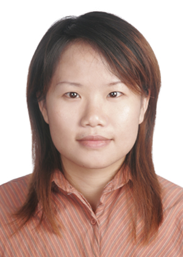
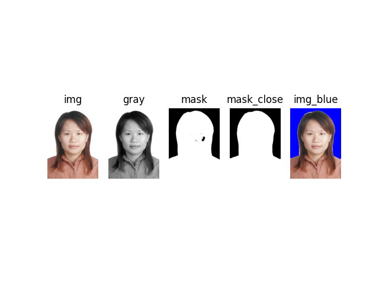
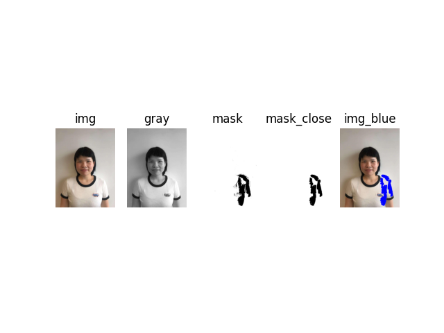
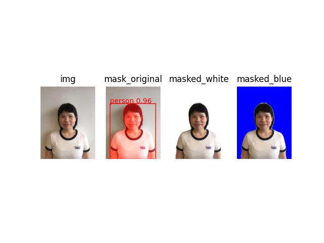

生活照转证件照需要做一些处理，包括换背景、扣头像、调尺寸、调光亮、调DPI，网上有很多在线处理程序（有点不安全），本地也有很多离线处理程序（有点不免费）。本文主要记录下在个人电脑上，基于OpenCV、YOLO实现生活照转证件照的过程。

<!--more-->

### 换背景

[标准证件照](https://baike.baidu.com/item/%E6%A0%87%E5%87%86%E8%AF%81%E4%BB%B6%E7%85%A7/3946934?fr=aladdin)是大家办理各种证书、填写各种档案的必备元素。以前照证件照需要去照相馆，配上背景幕布和补光灯，咔嚓一声，光鲜亮丽的证件照就出来了。现在手机拍照越来越方便，越来越清晰，于是去照相馆拍证件照的需求越来越少，大家更希望基于手机拍摄的生活照做一个证件照。

如果我们有一个标准证件照，只是做下背景的话的，这个比较简单。

<center></center>

核心流程如下:

```
基于opencv实现证件照白底转蓝底:
1. 灰度
2. 二值化
3. 取反
4. 闭运算
5. 换黑为蓝
```

核心代码如下：

```python
def test_cv_card():
    """
    基于opencv实现证件照白底转蓝底:
    1. 灰度
    2. 二值化
    3. 取反
    4. 闭运算
    5. 换黑为蓝
    """
    # 读取照片并显示
    img = cv2.imread(data_file_path('data/image/card/life3.jpg'))
    # 转换图片到灰度
    gray = cv2.cvtColor(img, cv2.COLOR_BGR2GRAY)
    # 应用阈值来找到非白色的部分（二值化）
    _, mask = cv2.threshold(gray, 230, 255, cv2.THRESH_BINARY)
    mask = cv2.bitwise_not(mask)
    # 闭运算
    kernel = np.ones((15, 15), np.uint8)
    mask_close = cv2.morphologyEx(mask, cv2.MORPH_CLOSE, kernel)

    # 黑色部分替换
    rows, cols, channels = img.shape
    img_blue = img.copy()
    for i in range(rows):
        for j in range(cols):
            if mask_close[i, j] == 0:  # 0代表黑色
                img_blue[i, j] = (255, 0, 0)  # 此处替换颜色，为BGR通道，不是RGB通道

    plt.subplot(151)
    plt.imshow(cv2.cvtColor(img, cv2.COLOR_BGR2RGB))
    plt.axis('off')
    plt.title("img")

    plt.subplot(152)
    plt.imshow(gray, "gray")
    plt.axis('off')
    plt.title("gray")

    plt.subplot(153)
    plt.imshow(cv2.cvtColor(mask, cv2.COLOR_BGR2RGB))
    plt.axis('off')
    plt.title("mask")

    plt.subplot(154)
    plt.imshow(cv2.cvtColor(mask_close, cv2.COLOR_BGR2RGB))
    plt.axis('off')
    plt.title("mask_close")

    plt.subplot(155)
    plt.imshow(cv2.cvtColor(img_blue, cv2.COLOR_BGR2RGB))
    plt.axis('off')
    plt.title("img_blue")

    plt.show()
```

核心结果如下：

<center></center>

补充说明：

- 为什么要做闭运算？因为我们在做二值化的时候，取的灰度空间是[230,255]，该空间下会有一些比较白（>230）的部分也会被错误的划分为白色背景，因此做了闭运算（先膨胀后腐蚀），把图片内部细节给去掉了。
- 原图一定要闭运算么？由于原图背景是存白的，且人像部分没有非常白的点，因此我们把二值的阈值设置额为[250,255]，也可以保证只有背景部分会被抠出来。


遇到问题：

如果背景色是白色，我们可以跟进上面的二值化和闭运算实现背景切换，但如果背景不是那么白，上面的方式就无能为力了，比如下面这个图，只把非常白的地方换成蓝色了，但整个背景墙面没有换。

<center></center>


### 生活照转证件照

上面提到的场景经常用到，需要把自己的生活照转为证件照，但是又不想使用在线工具。这是可以使用我们yolo-seg快速实现背景切换。

核心流程如下:

```
基于yolo-seg实现证件照白底转蓝底:
1. 推理（分割），获取Mask，如果很多物体，可能需要选取最大的或者人像的Mask
2. 生成背景色图片，根据Mask部分保留原始图片值
3. 注意由于yolo默认会把图片resize，所以得到的mask是resize后的，因此根据mask保留原图时也注意是缩放的原图。
```

核心代码如下：

```python
def test_yolo_seg_card():
    """yolo seg模型制作身份证"""
    model = YOLO(model_dir + "yolo11m-seg.pt")
    results = model(data_file_path('data/image/card/life1.jpg'))
    img = cv2.imread(data_file_path('data/image/card/life1.jpg'))

    # 这里特别注意，因为使用yolo训练的时候默认会把图片resize
    mask_array = results[0].masks.data[0].cpu().numpy().astype(np.bool_)
    h, w = mask_array.shape
    resized_img = cv2.resize(img, (w, h))  # 注意OpenCV中尺寸是先宽度后高度

    # 推理结果
    mask = np.zeros_like(resized_img)
    mask[mask_array] = [0, 0, 255]
    mask_resized = cv2.addWeighted(resized_img, 1, mask, 0.5, 0)
    mask_original = cv2.resize(mask_resized, (img.shape[1], img.shape[0]))

    # 白底
    masked_image = np.zeros_like(resized_img)
    masked_image[...] = 255
    masked_image[mask_array] = resized_img[mask_array]

    # 蓝底
    masked_image_blue = np.zeros(resized_img.shape, dtype=np.uint8)
    masked_image_blue[:, :, 0] = 255
    masked_image_blue[mask_array] = resized_img[mask_array]

    # 显示
    plt.subplot(141)
    plt.imshow(cv2.cvtColor(img, cv2.COLOR_BGR2RGB))
    plt.axis('off')
    plt.title("img")

    ax1 = plt.subplot(142)
    plt.imshow(cv2.cvtColor(mask_original, cv2.COLOR_BGR2RGB))
    plt.axis('off')
    plt.title("mask_original")

    plt.subplot(143)
    plt.imshow(cv2.cvtColor(masked_image, cv2.COLOR_BGR2RGB))
    plt.axis('off')
    plt.title("masked_white")

    plt.subplot(144)
    plt.imshow(cv2.cvtColor(masked_image_blue, cv2.COLOR_BGR2RGB))
    plt.axis('off')
    plt.title("masked_blue")

    boxes, names = results[0].boxes, results[0].names
    cls, conf = int(boxes.cls), float(boxes.conf)
    name = names[cls]
    label = f"{name} {conf:.2f}"
    box = boxes.xyxy.squeeze()
    rect = patches.Rectangle((box[0], box[1]), box[2] - box[0], box[3] - box[1], edgecolor='r', facecolor='none')
    ax1.add_patch(rect)
    ax1.text(box[0], box[1], label, color='red')

    plt.show()

```


核心结果过下：

<center></center>


### 换DPI

有些网站上传的证件照需要调整DPI（每英寸点数），通过**Pillow**可以快速设置DPI。


核心代码：

```python
def test_change_dpi():
    """改变图片的dpi"""
    image = Image.open(source_img)
    print(f"原图片信息 : {image.info}")
    print(f"原图片DPI: {image.info.get('dpi')}")
    print(f"原图片尺寸: {image.size}")

    new_dpi = (300, 300)
    image.info['dpi'] = new_dpi
    new_image_path = data_file_path('data/image/card/life1_dpi300.jpg')
    image.save(new_image_path, dpi=new_dpi)  # 调整DPI（这不会改变图像的实际像素尺寸，只改变元数据）
    new_image = Image.open(new_image_path)
    print("-" * 33)
    print(f"新图片信息 : {new_image.info}")
    print(f"新图片DPI: {new_image.info.get('dpi')}")
    print(f"新图片尺寸: {new_image.size}")
```


核心日志：

```
原图片信息 : {'jfif': 257, 'jfif_version': (1, 1), 'jfif_unit': 0, 'jfif_density': (1, 1)}
原图片DPI: None
原图片尺寸: (1080, 1439)
---------------------------------
新图片信息 : {'jfif': 257, 'jfif_version': (1, 1), 'dpi': (300, 300), 'jfif_unit': 1, 'jfif_density': (300, 300)}
新图片DPI: (300, 300)
新图片尺寸: (1080, 1439)
```


注意事项：

- JFIF元信息说明
  - **'jfif': 257**：这通常表示JFIF APP0标记的存在，257是标记的标识符。
  - **'jfif_version': (1, 1)**：表示JFIF的版本是1.1。
  - **'jfif_unit': 0**：表示没有指定单位，通常0表示无单位，1表示英寸，2表示厘米。
  - **'jfif_density': (1, 1)**：表示X和Y方向的密度，单位是上面`jfif_unit`指定的。由于`jfif_unit`为0，这里的密度没有实际意义。

- DPI与图像质量：

  - DPI主要影响打印时的尺寸比例，不会改变图像的像素质量。
  - 提高DPI不会使图像更清晰，除非同时增加了像素尺寸。
  
- 文件格式：

  - 确保保存为支持DPI信息的格式，如JPEG、TIFF。
  - PNG格式通常不支持嵌入DPI信息。
  
- 实际应用：

  - 在打印照片或制作证件照时，正确的DPI设置非常重要。
- 常见的证件照要求DPI为300或更高。

